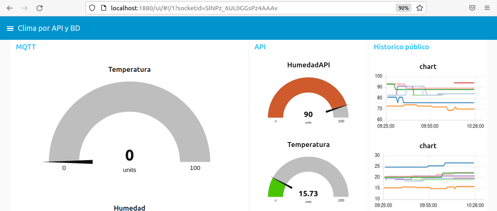
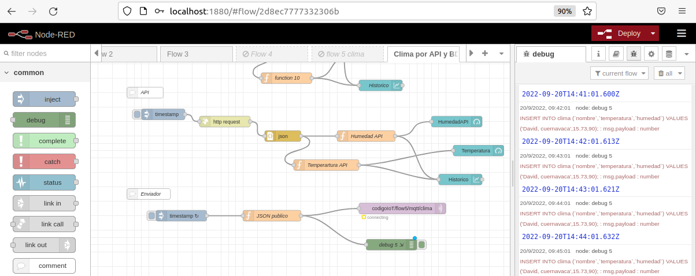
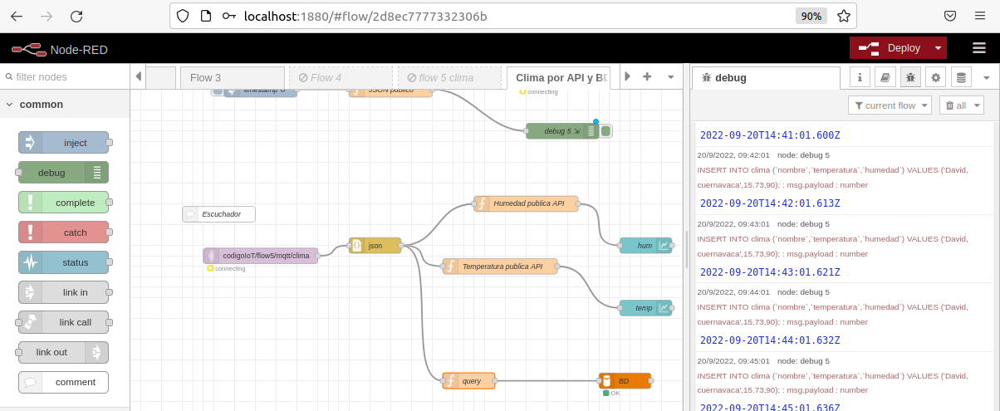
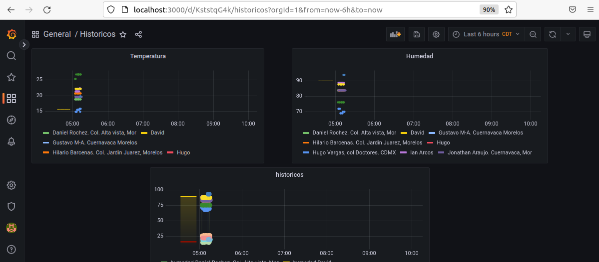

# clima-mysql
Se obtiene el clima por API y MQTT y almacena la información en una BD.

Instrucciones:

1. Instalar MySQL Server
   - sudo apt install mysql-server
2. Entrar a MySQL
   - sudo mysql
3. Mostrar bases de datos
Una vez entrado a la consola de la base de datos:
   - show databases;
4. Crear una nueva base de datos y usarla
   - create database codigoIoT;
   - use codigoIoT;
5. Crear una nueva tabla con los campos necesarios para el flow
   - id, fecha, nombre, temperatura, humedad 

# Incrustar grafana

1. Arrancar NodeRed y Arrancar Grafana
- node-red
- sudo /bin/systemctl start grafana-server

2. Comprobar el funcionamiento del flow
- Desactivar el flow5
- Verificar el dashboard del flow "Clima por API"

3. Generar gráficas
- Comprobar que la base de datos contenga información
	- sudo mysql
	- use codigoIoT;
	- SELECT * FROM clima;
- Agregar nuevo tablero
- Agregar nuevo panel
- Configurar el Panel

4. Configurar el flow para guardar la información de todos los que publican en el tema MQTT

Nodo Function Query

msg.topic = "INSERT INTO clima (`nombre`,`temperatura`,`humedad`) VALUES ('" + msg.payload.id + "'," + msg.payload.temp + "," + msg.payload.hum + ");";
return msg;

5. Insertar un panel de grafana en NodeRed

https://grafana.com/docs/grafana/v9.0/sharing/share-panel/

- Modificar el archivo gragana.ini el cual se encuentra en /etc/grafana
- allow_embedding = true
- sudo /bin/systemctl restart grafana-server

# Resultados

